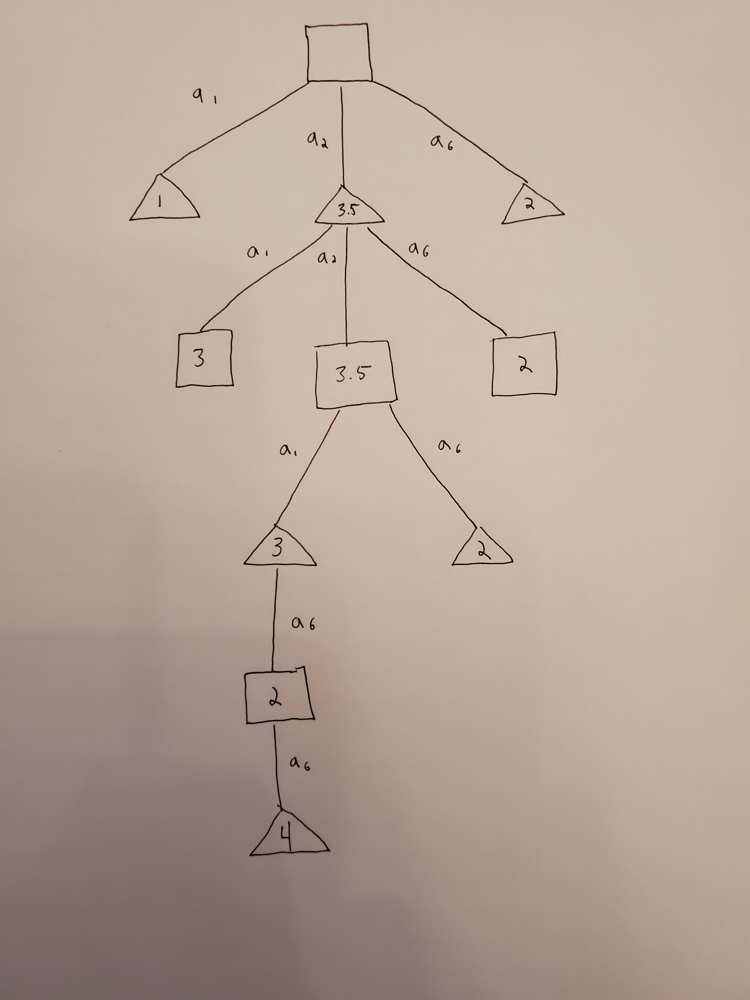
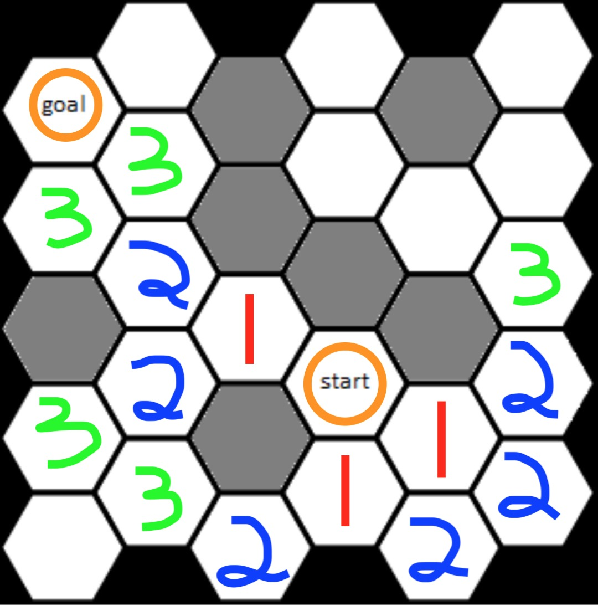
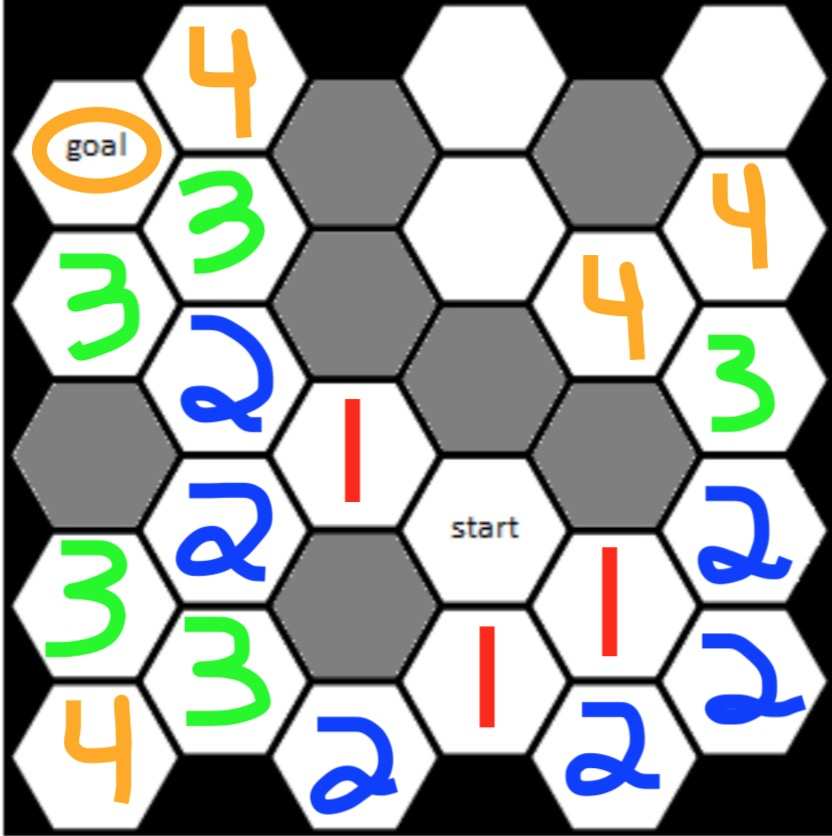
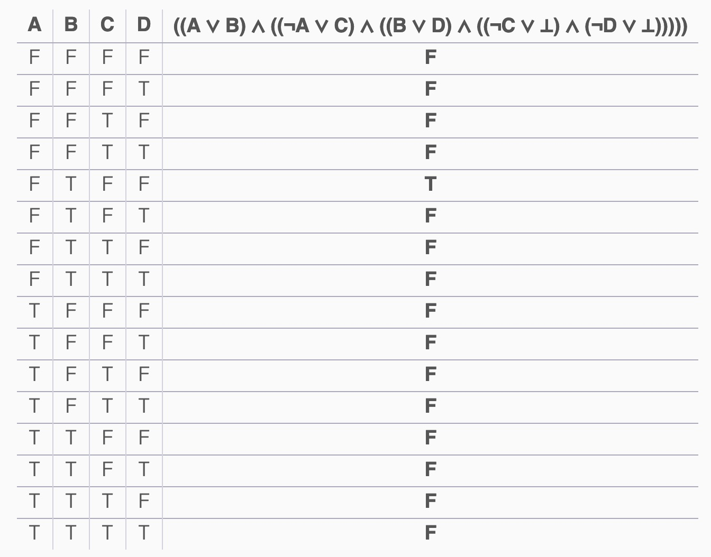

Robert Bonagura
# Midterm
## Question 1
#### 1. Define a State space, Action space, transition function and reward function for this problem.

The initial state *S<sub>i</sub>* of this problem consists of an n by m grid, that is represented with rows *R<sub>1</sub>* through *R<sub>n</sub>* and columns *C<sub>1</sub>* through *C<sub>m</sub>*. For every state *S<sub>k</sub>*, there are *n* x *m* cells, each denoted as *X<sub>R, C</sub>*. In the initial state, every cell in the grid is initally undefined, though contains a potential domain of *R* or *Y*. The **state space** consists of this initial state, as well as the set of actions and the corresponding transition function.

The **Action space** is the set of actions available at each state, where at any given state an agent can select between columns *C<sub>1</sub>* through *C<sub>n</sub>* (such that each column is not full). For each column *C<sub>k</sub>*, Action *A<sub>k</sub>* is defined as the agent dropping their token into *C<sub>k</sub>*, thus marking *X<sub>min, k</sub>* where *X<sub>min, k</sub>* is the lowest row cell in *C<sub>k</sub>* undefined.

Because the State space state consists of *n* x *m* cells, the **transition function** *R()* can be defined as *R(S, A<sub>k</sub>*) , where action *A<sub>k</sub>* is performed on state *S<sub>k</sub>*, thus returning state *S<sub>k+1</sub>*.

The **reward function** will be defined as the number of consecutive cells in a horizontal, vertical or diagonal line a player has marked their corresponding color, *R* or *Y*.

#### 2. What would be a good heuristic to use for this game and why? (note that this heuristic does not have to b aadmissible).

Outside of placing a fourth consecutive token and winning the game, I think the most important decision a player can make is to stop the opposing player from placing their fourth consecutive token into a cell. For this reason, I will define *h(x)* as the number of consecutive cells the player will have that includes cell *X*. If however, a cell *X* would give the opponent a fourth consecutive cell, *h(x)* would be defined as 3.5 . This would ensure that the heuristic value of a cell is consistent with the strategy described above, prioritizing winning the game first, preventing the opponent from winning second, and then thirdly maximizing the number of consecutive cells.

#### 3. Given the board state shown in Figure 2, use the minimax algorithm to determine the sequence of moves that 2 optimal players will make. You should show all work, the tree produced by the minimax algorithm and and indication of which child will be selected by the player at each internal node.

I have created a tree to show how two optimal players would continue the game of connect 4 based on the Board state from Figure 2. Each player will choose the action that returns the cell with the highest value returned by the heursitc function I defined. 

I have only expanded the nodes that would be explored in the minimax algorithm.

Square nodes represent a turn for *Red* and triangle nodes represent a turn for *Yellow*.

Action a<sub>k</sub> in the graph below corresponds to the action of dropping a token in column C<sub>k</sub>. Inside the node is the value returned by the heuristic function on that cell. Each node can make at most 3 actions because actions a<sub>3</sub>, a<sub>4</sub> and a<sub>5</sub> are invalid due to the fact that they each correspond to full column.



---
## Question 2
#### 1. What is the minimum number of cells that the shortest path first algorithm needs to expand in the grid shown in Figure 3 before finding a path to the goal (and why)?

For the shortest path first algorithm, we will define the weight between each neighboring cell as 1. Therefore, because all weights are the same, shortest path first will perform functionally the same as Breadth First Search.

We can find the minium number of cells needed to expand by counting each cell at every frontier untill we eventually reach the a frontier that has the goal cell as a neighbor.


<br>
<br>
<br>
So including the start and goal state, shortest path first would visit at a minimum 16 cells.

#### 2. Define an admissible heuristic for this problem. Show that this heuristic is admissible.

An admissible heuristic for a given cell *c* would be defined by looking at all of it's neighbors cells. If one of it's neighbors is the goal cell, *h(c)* is 1. If none of its neighbors are the goal cell, then *h(c)* is 2.

This heuristic is admissible because it never overestimates the cost of reaching the goal. 
* We only set *h(c)* to 1 if we know that we are 1 cell away from the goal.
* If none of cell *c*'s neighbors are the goal cell, then we can not guarantee how far we are. Therefore, a heuristic of 2 is admissible becauase if the goal were 1 cell away, then it would be a neighbor of *c*.

#### 3. What is the minimum number of cells A* wtih your heuristic needs to expand the grid shown in Figure 3 before finding a path to the goal.

The minimum number of cells visited by A*, based on my heuristic, is going to the same as the minimum number of cells visited by shortest path first, which is 16. 

What makes A* better is that the minimum number of cells expanded by A* will always be the same as the maximum number of cells expanded. This is because on the final frontier, the node adjascent to the goal node will always be exapnded fist when using my heuristic.

For shortest path first on the other hand, the maximum number of cells expanded on the final frontier is not guaranteed to be the same as the minimum number of cells expanded on the final frontier. For instance, if a heuristic was not involved, the shortest path first could potentially visit the number of cells highlighted below.


<br>
<br>
Therefore, the minumum number of cells needed to expand by A* is also 16 (when including both start and goal nodes).

---
## Question 3
#### 1. If you divided these characters based on the weapons what would be the information gain.

#### 2. Construct a classification tree that uses the attributes provided (Weapon, Height, Armor and Age) to classify the characters.

---
## Question 4
#### 1. Consider the Boolean Statement:

```((A or B) and (!A or C) and (B or D) and (!C or F) and (!D of F)) => F```

#### Show that this statement is or is not an axiom.

Let us assign *F* the value of False. Then, if some arrangement of *A, B, C, D* make the left side of the statement True, we will have a contradiction in True => False. Let us call this left-hand side of the statement *J*.

Below is the truth table generated by looking at all possible values for *A, B, C,* and *D* in *J*:



We can see that there is exactly one combination of values that make *J* equal to True, and that is *A*=False, *B*=True, *C*=False, *D*=False.

Therefore, when *A*=False, *B*=True, *C*=False, *D*=False, and *F*=False it creates a contradiction that reduces to True => False. This means that the Boolean statement is **not** an axiom.

---
## Question 5
#### Consider the Bayesian network shown in Figure 4, where variables A through E are all Boolean valued:

#### a. What is the probability that all five of these Boolean variables are simultaneously true?

P(A=True, B=True, C=True, D=True, E=True)<br>
= [ P(A) * P(B) * P(C) * P(D | A, B) * P(E | B, C)]<br>

P(A=True) = 0.2<br>
P(B=True) = 0.5<br>
P(C=True) = 0.8<br>
P(D=True | A, B) = 0.1<br>
P(E=True | B, C) = 0.3 <br>

Therefore:
P(A=True, B=True, C=True, D=True, E=True)<br>
= 0.2 * 0.5 * 0.8 * 0.1 * 0.3<br>
= 0.0024<br>
= 0.24 %

#### b. What is the probability that all five of these Boolean variables are simultaneously false?

P(A=False, B=False, C=False, D=False, E=False)<br>
= [ P(!A) * P(!B) * P(!C) * P(!D | !A, !B) * P(!E | !B, !C)]<br>

P(A=False) = 0.8<br>
P(B=False) = 0.5<br>
P(C=False) = 0.2<br>
P(D=False | !A, !B) = 1 - P(D=True | !A, !B) = 1 - 0.9 = 0.1<br>
P(E=False | !B, !C) = 1 - P(E=True | !B, !C) = 1 - 0.2 = 0.8<br>

Therefore:
P(A=False, B=False, C=False, D=False, E=False)<br>
= 0.8 * 0.5 * 0.2 * 0.1 * 0.8<br>
= 0.0064
= 0.64 %

#### c. What is the probability that A is false given that the four other variables are all known to be true?
A is not dependent on any other variables. Therefore,P(A=False | B=True, C=True, D=True, E=True) is simply P(A=False).

The probability that A is false is: 1 - P(A=True)<br>
= 1 - 0.2<br>
= 0.8<br>
= 80%

<!--
Because A is not dependent on D, we can write
P(A=False | B=True, C=True, D=True, E=True) as simply <br>
P(A=False)
P(A=False | D=True) where P(D)
= P(A) * P(D | !A)<br>
= 0.2 * (0.9 + 0.6)<br> 
-->