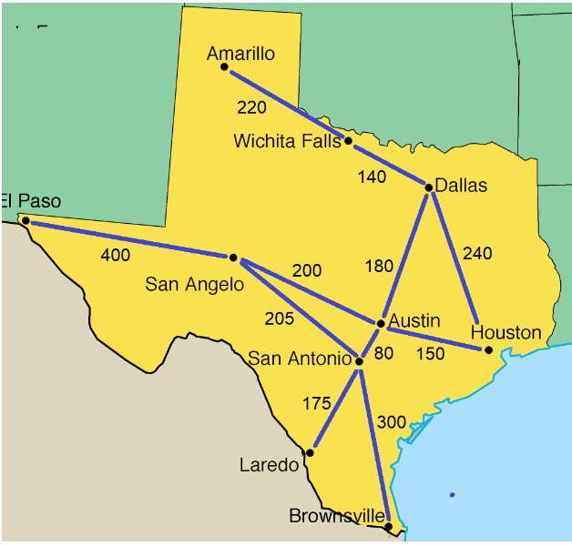
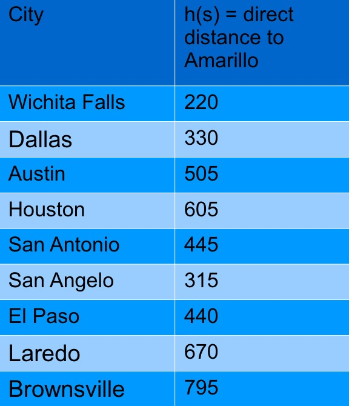

1-30-20
# Lecture 4 - A* Search, Minimax Search and Descision Trees
## Gradient Descent (review)
If the gradient is 0, it is a min, max or saddle point
* The second dervitive test can determine which of the above three options (<1, >1, or 0)

## A* Search
Orders nodes by the sum of the path length to the state and the heuristic of the state in a priority queue- guaranteed to give optimal path. (if using admissible heuristic)

### Admisible heuristics
One that never overestimates the cost from a node to the goal.
* if h(s') <= path_length(s', s_goal)

### Proof that Admissible Heuristics will always return optimal path to goal

Write-up of proof will be provided online. Study this because there may be some variation of this proof on exam.

### Example using map of Texas:
Finding path from Brownsville to Amaraillo. Using direct Euclidean distance of city to Amarillo as heuristic.

Key: 
S0 = Brownsville 
S1 = San Antonio 
S2 = Laredo 
S3 = Austin 
S4 = San Angelo 
S5 = El Paso 
S6 = Dallas 
S7 = Houston 
S8 = Wichita Falls 

h = direct Euclidean distance to Amarillo
* Pop S0 on Queue with a value of 0.
* Pop S0 off Queue and pop S1 onto Q
* S1 = 300 + 445 = 745
* S2 = 475 + 670 = 1095
* S3 = 380 + 500 = 885
* S4 = 505 + 315 = 820
* Pop San Angelo because it has shortest G value (820)
* S5 = 905 + 440 = 1345
* Pop Austin
* S6 = 560 + 330 = 890
* S7 = 530 + 605 = 1135
* Pop Dallas
* S8 = 700 + 220 = 920
* Pop Wichita
* Then we get Amarallo

Had we been doing Dijkstras, we wouldve had to expand out more cities.

#### How can we apply A* to problems with continuous stae spaces?
Robots in XY Plane? 
Problem is resolution - Think about a very high resolution. The faster the number of states exapnds the higher the computation cost. This will also scales with the number of dimensions added.

A* is bounded by the number of states so it increases in complexity with the number of states/dimensions.

One way to handle this would be to turn it into a graph problem.